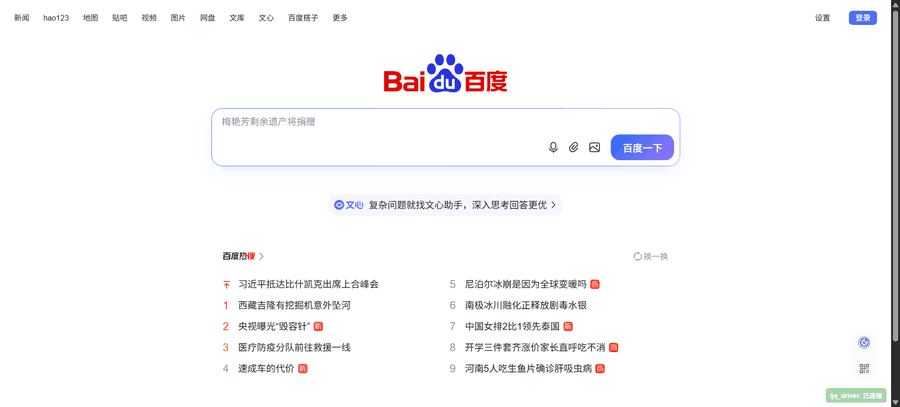

# dsh-tmwebdriver

> **Live demo** — the agent drives your real Chrome: opens Baidu, types a
> weather query, and reads the result widget (no headless scraping):



**What it does.** A DSH profile bundle that gives the agent direct control over
your real, logged-in browser. Instead of headless automation (which gets
fingerprinted and loses your sessions), it drives your actual Chrome through a
Chrome extension bridge — preserving cookies, logins, and real fingerprints.

**What it adds to DSH.** Two model-facing tools:

| Tool | Capability it adds |
|------|--------------------|
| `browser_list_tabs` | See what tabs are open in your real browser (id, url, title), optionally filtered by URL |
| `browser_execute_js` | Run JavaScript in any tab — read pages, click, fill forms, navigate, capture screenshots, read cookies, and drive CDP commands |

**When to use it.** Any task that needs your authenticated session: "open
Gmail and draft a reply", "check my GitHub notifications", "fill this form on
the site I'm logged into", "what tabs do I have open".


## Showcase — what "direct browser control" looks like

The agent drives your **real, logged-in** Chrome. These are actual runs:

### 🔍 "Search the weather in Beijing" (agent does the whole flow)

The agent types into Baidu, submits the form, and reads the weather widget —
no headless scraping, no API keys:

```text
Agent: browser_execute_js  →  location.href='https://www.baidu.com/'
       browser_execute_js  →  fill #kw with "北京天气" + form.submit()
       browser_execute_js  →  read #w_weather

Result: 北京  25°C  19~32°C  晴   AQI 优(27)  体感26°  南风2级
```

### 💡 What that unlocks

| Instead of... | With this plugin |
|---------------|------------------|
| Scraping a public site (rate-limited, bot-blocked) | Drive the site as a real logged-in user |
| Re-logging into every service for automation | Your existing sessions just work |
| Copy-pasting cookies/headers into scripts | The bridge handles cookies natively |
| Headless Chrome (fingerprinted, captcha-blocked) | Real Chrome with real fingerprints |

> Try it: open a DSH conversation and say *"what tabs do I have open?"* or
> *"log into my email and draft a reply"*.

**Self-contained.** The TMWebDriver master and the `tmwd_cdp_bridge` Chrome
extension are bundled here — no dependency on any external agent toolchain,
and the master auto-starts (with auto-install of its Python deps) on first use.

## Components

| Path | Purpose |
|------|---------|
| `src/index.ts` | DSH plugin: registers `browser_list_tabs` and `browser_execute_js` tools |
| `master/tmwebdriver_master.py` | TMWebDriver master (WebSocket 18765 / HTTP link 18766) |
| `master/start-master.ps1` / `.sh` | Optional manual master launcher (installs Python deps on first run) |
| `assets/tmwd_cdp_bridge/` | Chrome extension that bridges your tabs to the master |

## How it works

The plugin **lazily starts the bundled master on first tool call** (GA-compatible):
probe the link port; when nothing listens, spawn `master/tmwebdriver_master.py`,
wait until it accepts connections, then run the command. An already-running
master — started manually or by another client — is reused. The master stays
running (no auto-shutdown); a later call reuses it in milliseconds.

## Setup (3 steps)

### 1. Install the Chrome extension

1. Open `chrome://extensions`, enable **Developer mode**.
2. Click **Load unpacked** and select the `assets/tmwd_cdp_bridge/` folder.

### 2. Install the DSH plugin

From the plugin checkout directory (or any directory containing it):

```sh
dsh plugin --profile web add /path/to/dsh-tmwebdriver
```

Restart `dsh web` (or the profile you installed into) so the bundle patch
loads.

### 3. Use it

Open a new DSH conversation and ask the agent to list your browser tabs — the
first `browser_list_tabs` call auto-starts the master (a few seconds), and
everything after is instant.

> Optional: run `master/start-master.ps1` (Windows) or `master/start-master.sh`
> (macOS/Linux) once to pre-start the master manually. The launcher installs
> Python dependencies (`simple-websocket-server`, `bottle`, `requests`) on
> first run. Not required — the plugin auto-starts it.

## Tools

| Tool | Description |
|------|-------------|
| `browser_list_tabs` | List scriptable browser tabs (id, url, title). Optional `urlPattern` filter. |
| `browser_execute_js` | Execute JavaScript in a tab, or pass a JSON command string for the CDP bridge (`cookies`, `cdp`, `batch`, `tabs`). |

## Config

The bundle patch row (`cordis.patch.yml`) supports:

| Field | Default | Description |
|-------|---------|-------------|
| `linkUrl` | `http://127.0.0.1:18766/link` | TMWebDriver HTTP link endpoint |
| `timeoutMs` | `30000` | Per-call cooperative timeout budget |

## Requirements

- A DSH installation (any profile with `dsh-base`).
- Chrome with the `tmwd_cdp_bridge` extension loaded (step 1).
- Python 3 on PATH (the lazy-start spawns `python`; set `PYTHON` env to override).

## License

[MIT](LICENSE)

## Credits / Origin

This plugin embeds two components from the **GenericAgent** toolchain
(https://github.com/lsdefine/GenericAgent), which are redistributed here
unmodified for standalone use:

| Component | Path | Origin |
|-----------|------|--------|
| TMWebDriver master | `master/tmwebdriver_master.py` | GenericAgent — TMWebDriver.py |
| Chrome extension bridge | `assets/tmwd_cdp_bridge/` | GenericAgent — assets/tmwd_cdp_bridge/ |

Both remain under their original terms and copyright; see the respective
upstream project for details. The DSH plugin glue (`src/index.ts`,
`cordis.patch.yml`, `master/start-master.*`) is MIT-licensed as above.